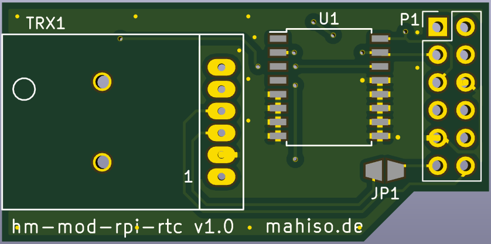
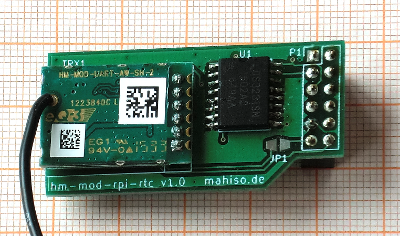
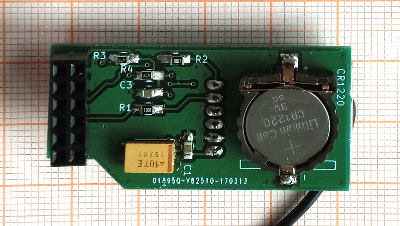

# hm-mod-rpi-rtc
## Schaltplan
[Schaltplan des Modules](hm-mod-rpi-rtc.pdf "Schaltplan")
## Bestückungsplan
- Vorderseite

- Rückseite

**Anmerkung**: Bestückungszeichnung der Batteriehalterung BT1 ist falsch. Eingesetzt (siehe untere Ansicht) ist die Halterung korrekt (Issue #3)

## Stückliste
|Bezeichnung|Wert / Bauform|Anmerkung|Reichelt Nr.|
|---|---|---|---|
|TRX1|HM-MOD-UART|aus ELV Bausatz|-|
|P1|Buchsenleiste 2x6|aus ELV Bausatz|-|
|U1|DS3231 / SOIC-16W ||DS 3231 S|
|R1,R2|1kΩ / 0805||RND 0805 1 1,0K
|R3,R4|4.7kΩ / 0805||RND 0805 1 4,7K|
|C1,C3|100nF / 0805||X7R-G0805 100N|
|C2|100µF/10V / Tantal B||TAJ 3528 100/10|
|BT1|Batteriehalter CR1220||-|
|CR1220|Batterie CR1220||CR 1220|

* Reichelt Bestellnummern ohne Garantie.

## Ansichten
- Bestückte Vorderseite

- Bestückte Rückseite

- Eingesetzt in Raspberry Pi 2

